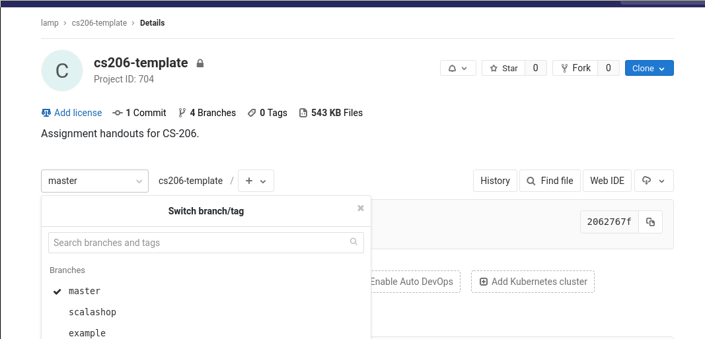

# CS-210 Assignments

This repository contains your assignments for *Functional Programming* course.
Course material and administrative details can be found in the
[cs-210-functional-programming-2019 gitlab
project](https://gitlab.epfl.ch/lamp/cs-210-functional-programming-2019).

## To select a branch on [gitlab.epfl.ch](https://gitlab.epfl.ch), click on "master" (under project description)

